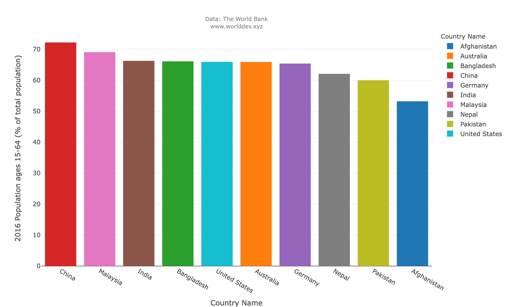
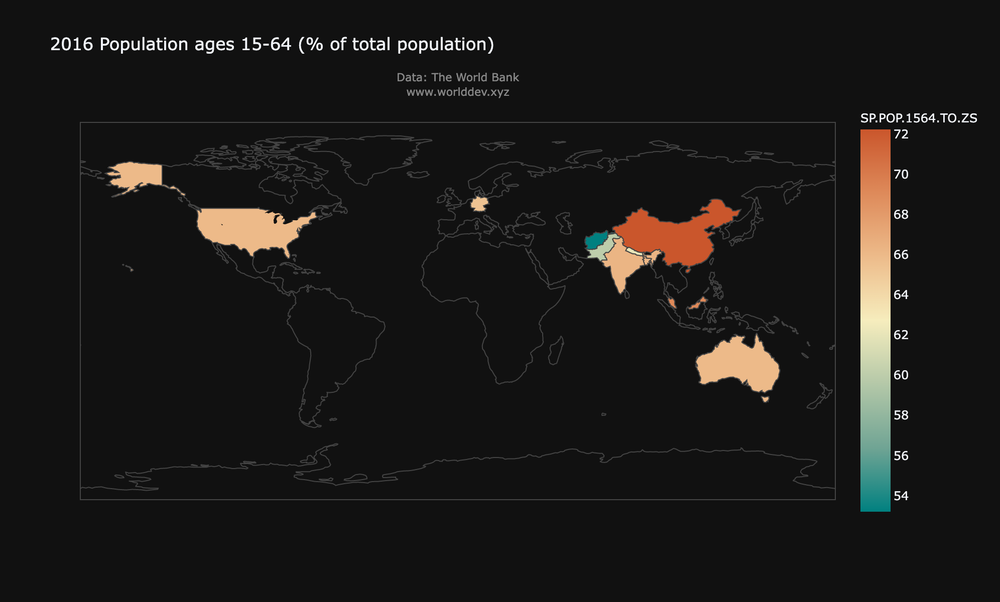
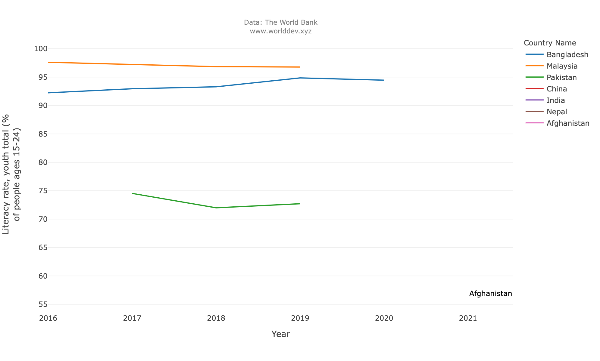
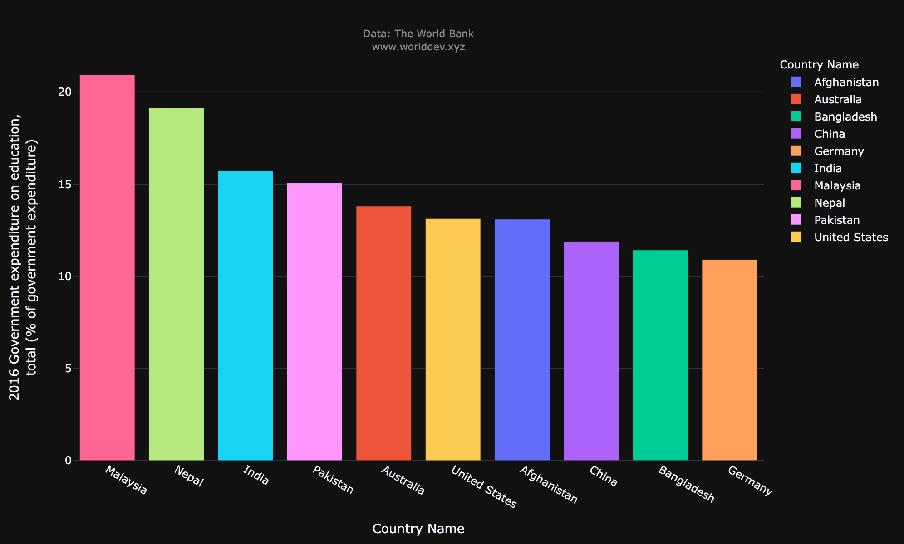
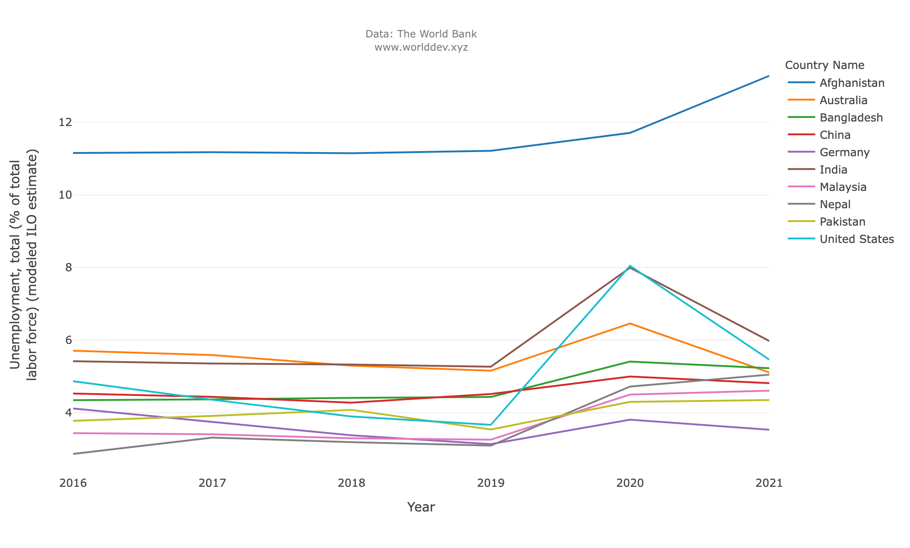
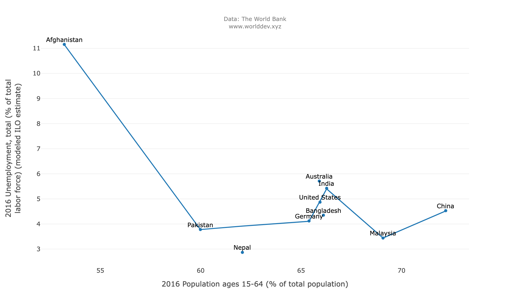
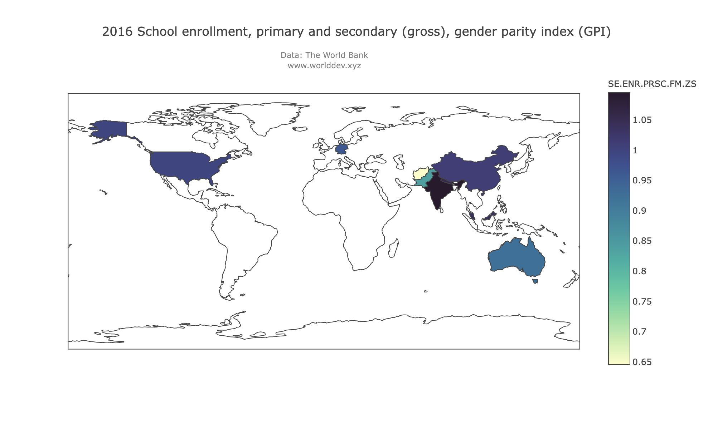
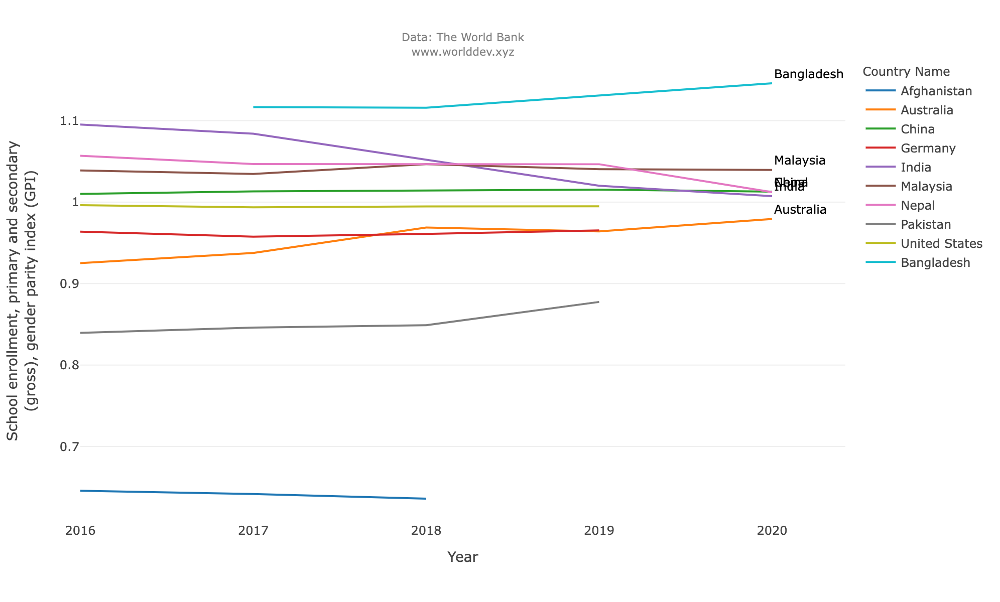
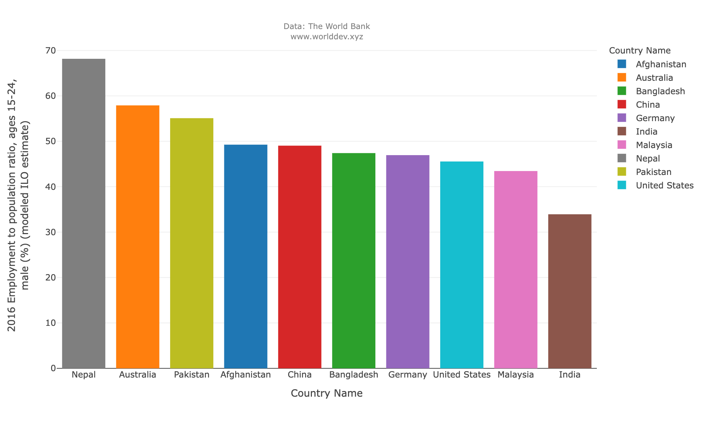
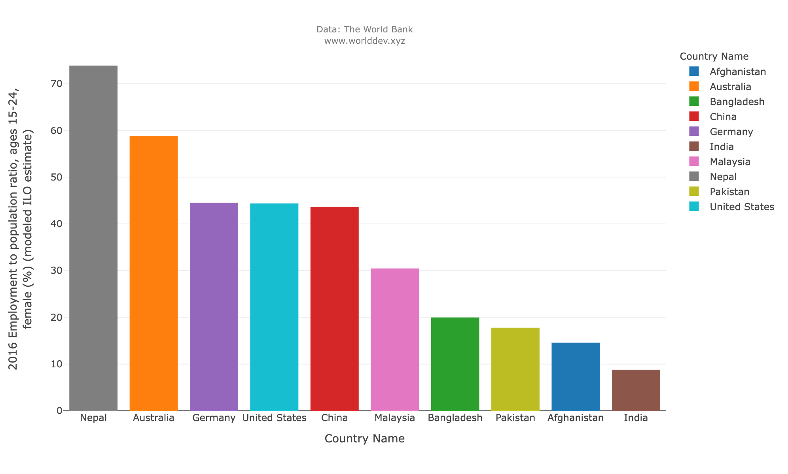

## Topics used for analysis : 
```
Education
Social Development
Gender
```

### Abstract:

- In this analysis, The primary topics used is Education and to analyse the data we used few indicators from Social development and Gender.
- Education means studying in order to obtain a deeper knowledge and understanding of a variety of subjects to be applied to daily life. Education is not limited to just knowledge from books, but can also be obtained through practical experiences outside of the classroom.
- In order for the entire world to really become equal, it needs to start with education. If everyone was provided with the same opportunities to education, then there would be less gaps between social classes.
- More than 260 million children worldwide are out of school, yet more than half of those in education are not learning, the "World Bank has warned".
- In today’s society, having an education is considered a vital part of being accepted by those around you. Having an education is believed to make you a useful part of society, and can make you feel like a contributing member as well.

### Global education facts: 

- In 39 out of 99 countries, fewer than 50% of the poorest children have completed primary school. In some countries like South Sudan, that figure is as low as 7%.
- More than 50% of young people in 58 out of 133 countries have not completed upper secondary school. In Niger, only 2% of its young people have completed this education.
- In 35 out of 75 countries, at least 25% of the poorest young women are illiterate. 
- In 30 countries, fewer than 90 females for every 100 males complete lower-secondary school. 

## Indicators used : 
```
- Population ages 15-64(% of total population).
- Literacy rate, youth total(% of people ages 15-24).
- Government expenditure on education, total(% of government expenditure).
- Unemployment, total(% of total labor force).
- School enrollment, primary and secondary (gross), gender parity index (GPI)
- Employment to population ratio, ages 15-24, female (%) (modeled ILO estimate)
- Employment to population ratio, ages 15-24, male (%) (modeled ILO estimate)
```
**Countries:**
```
- India
- Pakistan
- China
- Nepal
- Germany
- Bangladesh
- Australia
- Afganistan
- Malaysia
- United States
```

**Time Plot Years:**
- 2016 - 2021. 


## Analysis: 

**Population ages 15-64(% of total population):**



- In the above given graph, we could observe that China being a highly populated country stands in the first position with almost 72% of educated population from age 15 to 64. Followed bt Malaysia with 69 % of second highest educated crowd. Although, Afghanistan places in the last with about 53% it is quiet impressable being a small country.

**Literacy rate, youth total(% of people ages 15-24):**



- As we go through the above time series graph of the total youth literacy rate, Malaysia takes the highest position with an eventual growth of rate. The growth rate is quite interesting. Bangladesh falls second starting with 92% and ending at 94% starting in the year 2016 until 2021.Due to lack data for rest of the countries , we are unable to analyse.

**Government expenditure on education, total(% of government expenditure):**


- Analysing the above bar chart , Malaysia holds the top most position with 20 of amount spent by the government for education purposes. Second goes Nepal with 19%, followed by India, Pakisthan, Australia. 


**Unemployment, total(% of total labor force):**


- In the above time series graph, we could easily notice various zig-zag observations varying from year to year. The graph explains us the total percentage of unemployment. The highest percentage is taken by Afganisthan starting from 11% to 13%.Until 2019, the graph was consistent. After 2019 the percentage has suddenly increased. We can see in 2020 almost in all countries the unemployement was at spike maybe this was due to covid but later we see in all countries the digits were same of previous to 2019 except Afghanisthan.

**Umemployment vs Total Population:**


- In the ploted scatter graph , Afghanistan has highest percentage of unemployment, which constitutes around 11% whereas we can see Nepal even though being smallest country with highly education percent of 62%. They still have a feeble unemployment rate of 2%. This whole data was only for the year of 2016 the same consistency has been noticed till 2021 as discussed above there was you fluctuations in year 2020.


**School Enrollments:**



- On whole , We have a huge enrollment into school in both Bangladesh and India but if we look into the Time series data, we can noticed that eventually from ear 2016 to 2021 Bangladesh has gradually increased its number, whereas we can see decline in the enrollments of India. Afghanistan stood last in enrollments. Rest of all the countries has its consistency among all the years, and they have a constant enrollments.

**Employment to population ratio:**




- When we look into the employment to population ratio, we can see Nepal at top position followed by Australia and Pakistan. Indian stood at last.

## Conclusion: 

- I have opted for these specific countries as they margin the line of connection between the variables. Each country has a specific highest or lowest unemployment rate, literacy rate and has a appropriate time series with respect to given topics. The literacy rate of youth is highest in Malaysia followed by Bangladesh. 
- The highest percentage of unemployment is taken by Afganisthan and the least is taken by Nepal. Afganisthan unemployment rate conquers 1/4th of the entire chart. We could conclude that Afganisthan is comparitively placed less when it comes to eduction, literacy rate leading to a higher percentage of unemployment rate. 
- Sometimes, data can be better understood when presented by a graph than by a table because the graph can reveal a trend or comparison and could represent thousands of words. 
- Graphs are effective visual tools because they present information quickly and easily. In the world of statistics, graphs display the relationship between variables or show the value spread of a given variable or phenomenon.

